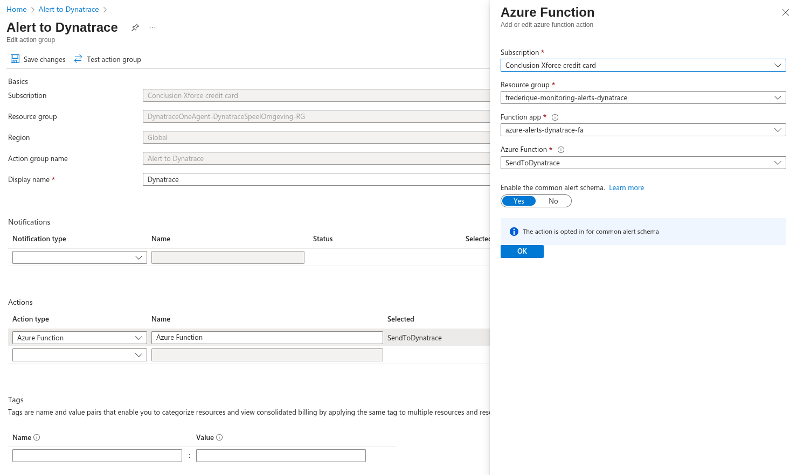

# Azure alerts Dynatrace

See for more information also the blog on the 
`Conclusion Xforce Tech Playground`: https://conclusionxforce.cloud/blog/azure-alerts-dynatrace/

## Installation

You can find the Terraform code in my repository [2]. First, copy the file 
`setenv.template.sh` to `setenv.sh` and change the content. Likewise, copy the
file `terraform.auto.template.tfvars` to `terraform.auto.tfvars` and change
the contents.

Then, use the following commands to deploy this solution to your enls lvironment:

```bash
. ./setup.sh
. ./login.sh
. ./deploy.sh
```

If you ever want to remove the resources from your environment, use the
following commands to do so:

```bash
. ./setup.sh
. ./remove.sh
```

## Permissions

When you look in the main.tf terraform file, it might seem double to both assign 
"Monitoring Reader" and "Reader" permissions. When you don't mind to give reader
permissions to the Azure Function, then remove the "Monitoring Reader" permissions.
When you do mind, then remove the "Reader" permissions. When you only give
"Monitoring Reader" permissions, the Azure Function will not send back tags of the
resource group of the resource that triggert the alert rule.

## Testing

You can use the test script to send a record with the most basic information to
the Azure Function. The steps are:

1) Copy the `testfunction.template.sh` file to `testfunction.sh`
2) Copy the default key from the Azure Function App (open the function app, left
   menu, Functions > App keys > default) and paste it in `testfunction.sh` 
   (in the ?code=... part of the URL)
3) Change the other variables in this script as well

The curl will result in a 204 errorcode when the call is successful. You can also
look in the invocation tab of the Azure Function.

## Configuration

Now the Azure Function works, you can add the Azure Function to the action group
of the monitoring alert. Example:


